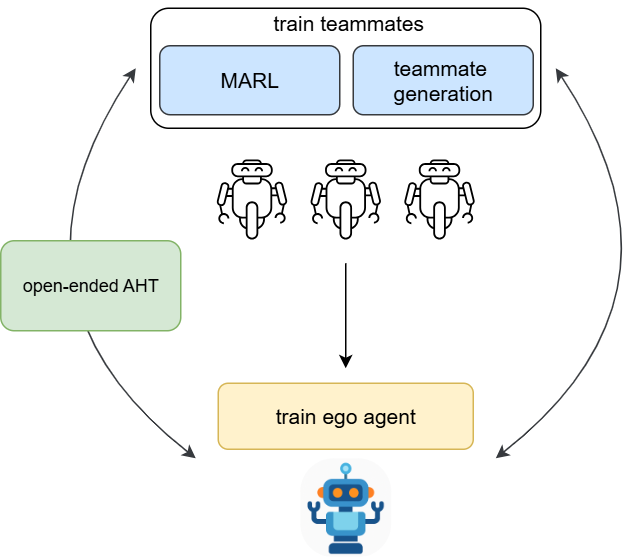

# jax-aht

Welcome to JaxAHT! This is a Jax-based benchmark repository for Ad Hoc Teamwork. 
If you find this repository useful for your research, please cite, 
```bibtex
@misc{jaxaht2025,
  author = {Learning Agents Research Group},
  title = {JaxAHT},
  year = {2025},
  month = {June},
  note = {Version 1.0},
  url = {https://github.com/carolinewang01/jax-aht},
}
```

## Design Philosophy



The JaxAHT library is designed to (1) facilitate research across the entire lifecycle of ad hoc teamwork, and (2) ease the evaluation of ad hoc agents (ego agents) for commonly used AHT benchmark tasks. As such, the benchmark includes: 
- AHT algorithms 
- Environments
- Evaluation teammates for each environment

The library includes a variety of MARL/AHT algorithms, as AHT research often requires orchestrating multiple algorithms: 
- An ego agent training algorithm
- A teammate generation algorithm
- A multi-agent reinforcement learning (MARL) algorithm
- A single-agent reinforcement learning method to act as a best response operator.

Research focused on one type of algorithm can require other types for training/evaluation purposes. 
For example, to evaluate a teammate generation method, an ego agent training method is necessary. 
Similarly, an ego agent training method requires a set of training teammates, which may be generated by a teammate generation algorithm or a MARL algorithm.

This codebase aims to provide a unified interface for the above AHT procedures, to enable research on both individual procedures and combinations thereof. 
On the other hand, to facilitate fast iteration, we take inspiration from the single-file model used by projects such as JaxMARL and CleanRL and minimally modularize the code. 
Algorithms are largely implemented in a single-file format to enable researchers to easily understand and build upon existing methods. However, the agent interface is shared by all methods, to allow agents trained by one algorithm to easily be used by another algorithm---a common workflow for AHT research.

Our modularization is restricted to environments, agents, and populations, which allows us to cleanly interface the algorithm types above, while placing most of the logic for any single algorithm within a single file.


##  Table of Contents
- [🚀 Installation Guide](#-installation-guide)
- [▶️ Getting Started](#️-getting-started)
- [📝 Code Overview](#-code-overview)
  - [🎨 Code Style](#-code-style)
  - [✔️ Code Assumptions](#️-code-assumptions)
- [🗺️ Project Structure](#️-project-structure)
  - [💡Algorithm Implementations](#-algorithm-implementations)
    - [Running an Algorithm on a Task](#running-an-algorithm-on-a-task)
    - [Logging](#-logging)
  - [🤖Agents](#-agents)
  - [🧑‍🤝‍🧑 MARL (IPPO)](#-marl-ippo)
  - [🌳 Environments](#-environments)
    - [Jumanji (LBF)](#jumanji-lbf)
    - [Overcooked-v2](#overcooked-v2)
  - [🖼️ Paper Visualizations](#️-paper-visualizations)
    - [Computing Normalization Bounds](#computing-normalization-bounds)
- [📄 License](#-license)
- [🔗 See Also](#-see-also)


## 🚀 Installation Guide

Follow instructions at `install_instructions.md` to install the necessary libraries.

Evaluating trained agents against the heldout evaluation set (referred to as $\Pi^\text{eval}$ in the paper) requires downloading the evaluation agents.
Reproducing the plots from the paper requires the computed best returns achieved against each evaluation agent, which are stated in the paper appendix.
Directories containing both data can be obtained by running the provided data download script:
```python
python download_eval_data.py
```
## ▶️ Getting Started: 
Algorithms are sorted into four main directories in this codebase. 

- `ego_agent_training/`: contains algorithms for training an AHT agent against a pre-specified set of teammates
- `marl/`: contains MARL algorithms for training a team of agents from scratch
- `open_ended_training/`: contains open-ended AHT algorithms
- `teammate_generation/`: contains teammate generation algorithms.

Each contains a `run.py`, that serves as an entry point 
We provide an `experiments.sh` for open-ended and teammate generation methods that runs the algorithm specified 
at the top of the `experiments.sh`, on LBF and Overcooked tasks. 

## 📝 Code Overview

### 🎨 Code Style
JaxMARL follows a single-script training paradigm, which enables jit-compiling the entire RL training loop and makes it simple for researchers to modify algorithms.
We follow a similar paradigm, but use agent and population interfaces, along with some common utility functions to avoid code duplication.

### ✔️ Code Assumptions/Gotchas
The code makes the following assumptions:
- Agent policies are assumed to handle "done" signals and reset internally.
- Environments have homogeneous agents and discrete actions
- Environments are assumed to "auto-reset", i.e. when the episode is done, the step function should check for this and reset the environment if needed.

Gotchas
- The metric, `returned_episode_returns` is automatically tracked and logged by the LogWrapper. It corresponds to summing up the reward returned by env.step() over an episode. Thus, if an environment returns a shaped reward, it corresponds to the shaped return. 

## 🗺️ Project Structure

The project structure is described here. Additional notes about some folders are provided.

- `agents/`: Contains agent related implementations.
- `common/`: Shared utilities and common code.
- `envs/`: Environment implementations and wrappers.
- `evaluation/`: Evaluation and visualization scripts.
- `ego_agent_training/`: All ego agent learning implementations. Currently only supports PPO.
- `marl/`: MARL algorithm implementations. Currently only supports IPPO.
- `open_ended_training/`: Open-ended learning methods (ROTATE, PAIRED, Minimax Return).
- `teammate_generation/`: Teammate generation algorithms (BRDiv, FCP, CoMeDi).
- `tests/`: Test scripts used during development.
- `vis/`: Code to generate plots shown in the paper.

### 💡Algorithm Implementations

The algorithms in this codebase are divided into four categories, and each is stored in its own directory:
- MARL algorithms, located at `marl/`
- AHT (Ad Hoc Teamwork) algorithms
    - Ego agent training methods, located at `ego_agent_training/`
    - Two-stage teammate generation methods, located at `teammate_generation/`
    - Open-ended AHT methods, located at `open_ended_training/`

Note that algorithms from the `marl/` and `ego_agent_training/` categories are called as subroutines in the other two categories.
For example:
- FCP uses the `marl/ippo` implementation as the teammate generation subroutine.
- Two-stage teammate generation methods use `ego_agent_training/ppo_ego.py` as the ego agent training routine.


#### Running an Algorithm on a Task

Within each directory, there is a `run.py` which serves as the entry point for
all algorithms implemented within the directory.

We use Hydra to manage algorithm and task configurations.
In each directory above, there is a `configs/` directory with the
following subdirectories:
- `configs/algorithm/`: Contains algorithm configs, for each algorithm and task combination.
- `configs/hydra/`: Contains Hydra settings.
- `configs/task/`: Contains environment configs necessary to specify a task.

Given an algorithm and task, Hydra retrieves the appropriate configs from the subdirectories above
and merges them into the *master config* found in `configs/base_config_<method_type>.yaml` (e.g., `configs/base_config_teammate_generation.yaml`).
The algorithm and task may be manually specified by modifying the master config, or by using
Hydra's command line argument support.

For example, the following command runs Fictitious Co-Play on the Level-Based Foraging (LBF) task:
```bash
python teammate_generation/run.py task=lbf algorithm=fcp/lbf
```

Note that Hydra allows the user to modify any config value specified in the algorithm/task config files from the command line. For example, to set the number of training interactions for FCP, use the following command: 

```bash
python teammate_generation/run.py task=lbf algorithm=fcp/lbf algorithm.TOTAL_TIMESTEPS=1e5
```


#### Logging

By default, results are logged to a local `results/` directory, as specified within the `configs/hydra/hydra_simple.yaml` file for each method type, and to the Weights & Biases (wandb) project specified in the master config.
All metrics are logged using wandb and can be viewed using the wandb web interface.
Please see the [wandb documentation](https://docs.wandb.ai/) for general information about wandb.

Logging settings in each master config allow the user to control whether logging is enabled/disabled.

### 🤖 Agents

The `agents/` directory contains:
- Heuristic agents for Overcooked and LBF environments.
- Various actor-critic architectures.
- Population and agent interfaces for RL agents.

You can test Overcooked heuristic agents by running, `python tests/test_overcooked_agents.py`,
and the LBF heuristic agents by running, `python tests/test_lbf_agents.py`.

### 🧑‍🤝‍🧑 MARL (IPPO)
The `marl/` directory stores our IPPO implementation.
To run it with wandb logging and using the configs, run:
```bash
python marl/run.py task=lbf algorithm=ippo/lbf
```
Results are logged via wandb, but can also be viewed locally in the `results/` directory.

### 🌳 Environments
#### Jumanji (LBF)
The wrapper for the Jumanji LBF environment is stored in the `envs/` directory, at `envs/lbf/lbf_wrapper.py`. A corresponding test script is stored at `tests/test_lbf_wrapper.py`.
`
#### Overcooked-v1
We made some modifications to the JaxMARL Overcooked environment to improve the functionality and ensure environments are solvable.

- **Initialization randomization**: Previously, setting `random_reset` would lead to random initial agent positions, and randomized initial object states (e.g. pot might be initialized with onions already in it, agents might be initialized holding plates, etc.). We separate the functionality of the argument `random_reset` into two arguments: `random_reset` and `random_obj_state`, where `random_reset` only controls the initial positions of the two agents. 
- **Agent initial positions**: previously, in a map with disconnected components, it was possible for two agents to be spawned in the same component, making it impossible to solve the task. The Overcooked-v1 environment initializes agents such that one is always spawned on each side of the map.


### 🖼️ Paper Visualizations

The `vis/` directory provides basic visualization scripts to visualize results generated by this benchmark. 

The instructions here assume that you have downloaded the evaluation data already, as specified in the Installation Guide.

1.  Specify experiment paths at `vis/plot_globals.py`
2.  Run `bash vis/make_paper_plots.sh` to generate and save the paper figures. Figures are stored at `results/figures` by default. By default, the figures are normalized using bounds provided in the downloaded data. See instructions below to compute your own normalization upper bounds. 

*Note:* The first time that the code is run, it may take a while to generate the metrics and create the plots---around 5 minutes for each bar chart. The first time that a particular experimental result is processed, a cache file is automatically generated and stored within each experimental result directory, which makes subsequent runs of the visualization scripts much faster.
Cache files can be cleared by running, `python vis/clean_cache_files.py`.

#### Computing Normalization Bounds
You can compute your own normalization upper bounds using the `vis/compute_best_returns.py` script to walk your `results/` directory to recompute the best seen returns for each evaluation partner.
For usage, see the bash script, `vis/get_best_returns.sh`.

Alternatively, if you do not wish to recompute the normalization upper bounds or download the provided normalization bounds, you can use the development performance bounds provided directly in `evaluation/configs/global_heldout_settings.yaml` to normalize the results by setting the `renormalize_metrics` argument of the `load_results_for_task()` function to `False`.
Note that the development upper performance bounds are not as high as the normalization upper bounds downloaded by `download_eval_data.py` as they were computed earlier in the project.

## 📄 License
This project is licensed under the MIT License - see the [LICENSE](LICENSE) file for details.

## 🔗 See Also
This project was inspired by the following Jax-based RL repositories. Please check them out!
- [JaxMARL](https://github.com/FLAIROx/JaxMARL): a library with Jax-based MARL algorithms and environments
- [Jumanji](https://github.com/instadeepai/jumanji): a library with Jax implementations of several MARL environments
- [Minimax](https://github.com/facebookresearch/minimax): a library with Jax implementations of single-agent UED algorithms
- [ROTATE](https://github.com/carolinewang01/rotate): code for the ROTATE paper (Wang et al. 2025), which this benchmark is built off of.